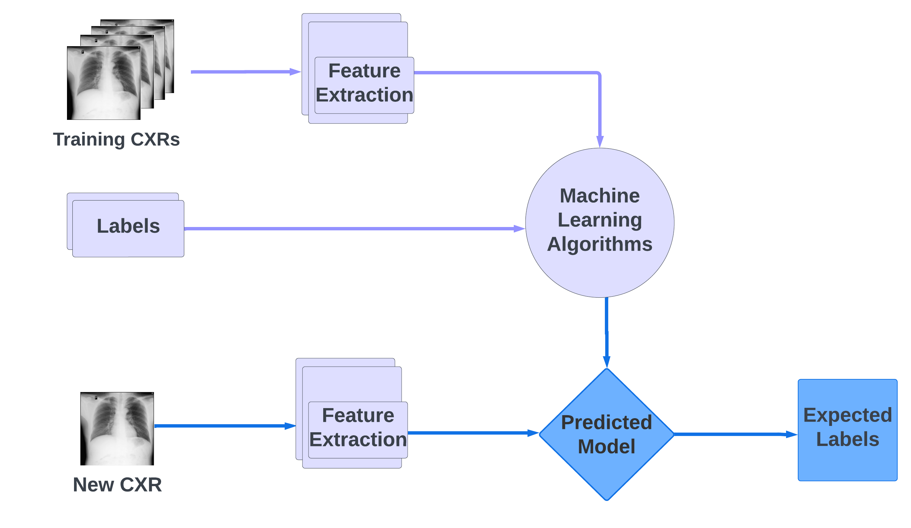

# Portfolio
---
## Natural Language Processing 

### Sentiment Analysis on Yelp Reviews: Yelp API, RF, Gradient Boosting and BERT

**Collect data from Yelp Fusion API:** Using Yelp API, I collected more than 20,000 Yelp restaurants' reviews in the Bay Area using ***requests*** and ***json*** libraries.

**Sentiment Analysis**

---

## Images Classification

### Predict Lung Abnormalities with PCA, SVM and Neural Networks

  First I converted the data into pixel and performed data analysis to understand how the data have been created for better modeling choices. Then I extracted the important features using PCA 95%. I trained machine learning models to learning pattern of normal and abnormal chest X-ray from the train data. Lastly, I used the train model to classified the chest X-ray from the test set with 90% accuracy. 

 

 

 

---

## Data Science

### Predict Rental Cost in Brazil using RidgeCV, Lasso regression and BoxCox transformation

  I performed comprehensive data analysis to handle missing values, outliers, perform feature engineering and feature selection to understand the important features. I ensembled machine learning models to predict the rental cost in Brazil. My most optimal model had resolved the severe non-normality problem and achieved an accuracy of 91% with a mean square error of 0.041.

 

 

 

### Creat Chatbot using Streamlit and Openai

 I used openai.Completion to generate a response for a given question and streamlit session state to get text input, store the chat and display the chat history. I was able to create a simple chatbot that can take in the users questions, direct it to openai ChatGPT and send back responses that are generated through openai.

 

 

 

---

## Cooking videos by me

 Besides Data Science, I love cooking. I am not a professional chef, but I have a passion for cooking. I learn most of the recipes from online platforms, make mistakes before I get a perfect recipe for myself. Hence, I share my recipes on YouTube and I want others to know that we can improve ourselves by keeping learning everyday and anytime.  

- [Oatmeal bow for breakfast](https://www.youtube.com/watch?v=_fB3Zdgr9Aw)
- [Palak tambli](https://www.youtube.com/watch?v=1SPz_p7u1bg)
- [Chocolate icecream](https://www.youtube.com/watch?v=lxAca4Lv-z0)
- [Dalgona coffee](https://www.youtube.com/watch?v=SmHp9wdCk2I&t=1s)

---
